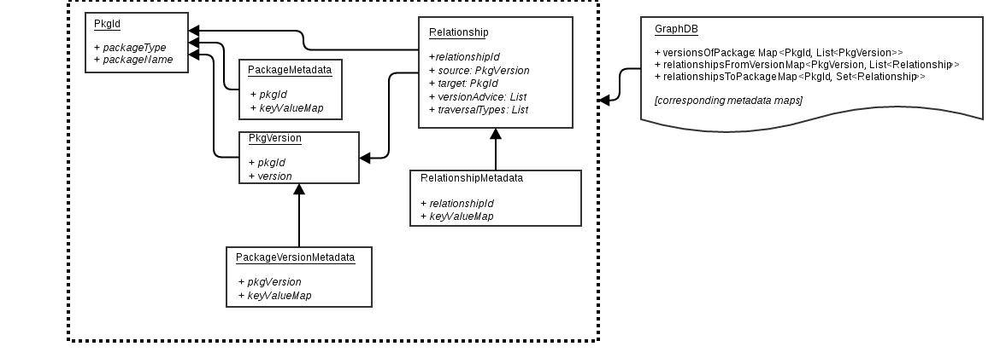
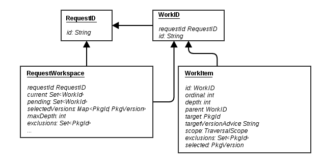

Data Models
-----------

## Contents

<!-- toc -->

- [Introduction](#introduction)
  * [Graph Data Model](#graph-data-model)
    + [Diagram](#diagram)
    + [Package Key (PkgId)](#package-key-pkgid)
    + [Package Metadata](#package-metadata)
    + [Package Builds (PkgVersion)](#package-builds-pkgversion)
    + [Package Version Metadata](#package-version-metadata)
    + [Version-to-Package Relationship (Relationship)](#version-to-package-relationship-relationship)
      - [Example: Indy, Galley, and Weft](#example-indy-galley-and-weft)
    + [Relationship Metadata](#relationship-metadata)
  * [Traversal Data Model](#traversal-data-model)
    + [Diagram](#diagram-1)
    + [RequestWorkspace](#requestworkspace)
    + [RequestID](#requestid)
    + [WorkItem](#workitem)
    + [WorkID](#workid)

<!-- tocstop -->

## Introduction

We have two data models in Cartographer 2.0 that are used operationally (that is, not accessible directly by the user). These are kept mostly separate, with a one-way relationship between them. Specifically, data structures in the WorkDB can reference things in the GraphDB, but not the other way around.

The reason for this is to keep the traversal state from leaking into the database that stores the graph structure itself. In earlier Cartographer designs, this leaking of traversal state into the graph led to users having to discard the graph structure and re-resolve almost every time it was used. While there are still some edge cases we haven't captured, mainly related to rebuilds of existing versions (things that should be VERY tightly scoped from an environmental perspective), most of the graph DB is designed to be immutable so we don't have to re-discover the whole graph each time we run a traverse.

### Graph Data Model

#### Diagram

#### Package Key (PkgId)

Each package in the graph should have a type specifier, which will
probably act like a namespace to constrain traversals. Additionally,
each PackageKey should have a packageName that's unique within that
packageType.

#### Package Metadata

This will allow Cartographer to accept annotations on packages.

#### Package Builds (PkgVersion)

Each
package will be associated with zero or more builds. The builds
themselves contain relationships to other packages, not the builds
themselves. Builds add a buildId, version,
and build descriptor (Maven == rebuild suffix, RPM == release, whatever
you want to call it). Packages do not contain relationships directly,
since the particular relationships to other projects can vary by build.

#### Package Version Metadata

Allow annotation of package builds.

#### Version-to-Package Relationship (Relationship)

Represents the structural information that defines a relationship
between projects. The relationship will contain a source node, which is
a PkgVersion (build of a package), and will reference a target node,
which is a PkgId (package, not a build) along with advice about what
version to select during traversal. This will allow user request state
to override the suggested target package build during a traversal,
without requiring changes to the graph structure itself. In addition to
"from" and "to" information, each relationship will contain
packageType-specific information to facilitate filtering. For instance,
for RPMs this might be build/runtime dependency type. For Maven, it
might include dependency scope, managed vs. direct flag for plugin or
dependency relationships.

##### Example: Indy, Galley, and Weft

This way of modeling inter-package relationships may seem strange. Let's
illustrate it with an example to help make it clearer.

For example, assume I depend on galley-core 0.15.0 and
weft
1.3 in Indy. However, in Galley's 0.15.0
release, it depends on weft 1.4.

When we build the traverse the graph starting with galley-core, there is
no additional context for weft, and Cartographer will select version 1.4
for inclusion in the traverse.

However, when we traverse the graph starting with Indy, Indy's own
dependency on weft 1.3 will establish a selection history for weft (weft
will actually be traversed directly from Indy, concurrently with
galley-core). Later, when we traverse galley-core and come to the
dependency on weft declared there, we discard galley's version advice
for weft and use our own traversal history to select the version.

Complicating things further, if I (a Cartographer user) know that weft
1.3 and 1.4 contain a CVE, and want to force the use of 1.4.1, I can
submit my traverse request along with an override to weft that specifies
the 1.4.1 version for use. In this case, all version advice throughout
the graph related to weft is discarded, and my specified version
override is used.

For these reason, we don't express relationships as targeting builds of
other packages. If we expressed relationships as being between builds,
we would have to provide a mechanism for doing relationship substitution
for the above example. That's one of the great mistakes that made
Cartographer 1.x very complex, and limited our ability to rely on static
graph structures stored in a database.

#### Relationship Metadata

Extra annotations of project relationships that aren't used for
traversal. This is tricky, since the specific target package build may
vary across user requests. Such variance may make it hard to annotate
these relationships with anything meaningful.

### Traversal Data Model

User requests are used to create RequestWorkspace instances, which hold
not only the initial state of the traversal (user-specified details),
but also keep track of version selections, nodes being processed, and
other traversal details associated with the user's original request. The
RequestID forms the key for a RequestWorkspace, and also forms part of
the key for WorkItems related to that workspace. WorkItems are keyed by
WorkIDs, and keep the state associated with selecting, resolving,
traversing a package (PkgId and PkgVersion, at various stages of this
process). WorkItems are associated with a particular RequestWorkspace
since their traversal details will depend on both the initial conditions
set by the user and the history of the graph traversal (which itself
depends on initial conditions).

The identifier classes described below are especially important for
passing information from service to service without having to serialize
and deserialize large data objects constantly, through the MQ. Instead,
retrieval of these traversal data structures can be much more targeted
and directed at the data store, which can be optimized more easily.

#### Diagram

#### RequestWorkspace

Tracks the working state of a user's request to Cartographer, including
nodes currently being processed and node pending processing.

#### RequestID

Primary key for the traverse spawned by a user request. Passed back to
the user, this ID can be used to retrieve status for the traverse,
activity logs, and the formatted result (once traversal is complete).

#### WorkItem

Each node in the graph traversal moves from vague reference to concrete
PkgVersion, and ultimately into the set of traversed nodes. Along the
way, different services require various information about the node in
order to do their jobs. WorkItem accumulates this information and makes
it available to successive services. Finally, when the traversal is
complete, WorkItems are used as input to the formatting step, where the
formatter has access to all of the state accumulated about that node
during processing.

WorkItems typically start with the target information from the 
Relationship used to create them: namely, the target PkgId and target 
version advice. Ordinal is also drawn from the Relationship, while
depth and parent WorkId are both drawn from the WorkItem whose
traversal resulted in the creation of this new WorkItem. Exclusions are
hybridized from the parent WorkItem and the Relationship information.

As the WorkItem proceeds through selection, the target PkgId is
refined to a "selected" PkgVersion, or a specific, versioned release of
the PkgId. This selected PkgVersion is used during the resolution and
traversal steps, where the process repeats.

Obviously, there are many more details involved with traversing the 
package-relationship graph. For more information, see the section on
[Workflow](workflow.html).

#### WorkID

WorkIDs uniquely identify a piece of work moving through the system.
They are composed of a package-specific string and a RequestID, since
traversal of any given node can be influenced by the user's initial
request (think overridden versions) or the traversal history (previously
selected versions).
